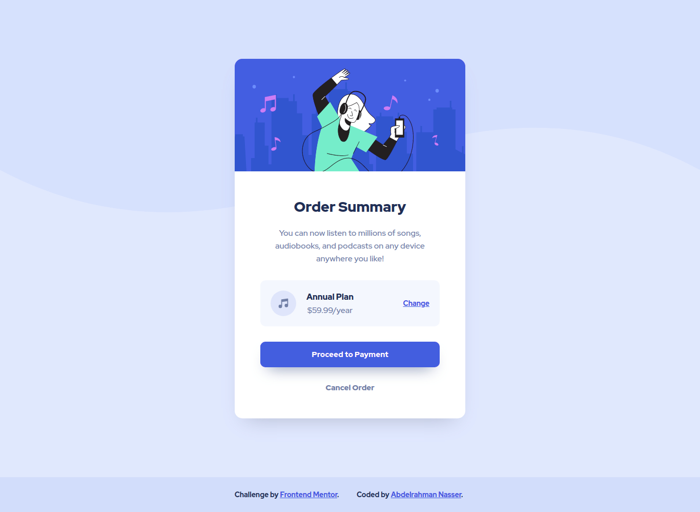

# Frontend Mentor - Order summary card solution

This is a solution to the [Order summary card challenge on Frontend Mentor](https://www.frontendmentor.io/challenges/order-summary-component-QlPmajDUj). Frontend Mentor challenges help you improve your coding skills by building realistic projects. 

## Table of contents

- [Overview](#overview)
  - [The challenge](#the-challenge)
  - [Screenshot](#screenshot)
  - [Links](#links)
- [My process](#my-process)
  - [Built with](#built-with)
  - [Continued development](#continued-development)
- [Author](#author)

## Overview

### The challenge
- build out this order summary card component and get it looking as close to the design as possible.
- Users should be able to See hover states for interactive elements

### Screenshot

### Links

- [Solution URL](https://www.frontendmentor.io/solutions/order-summary-card-solution-B1ndcHNfK)
- [Preview  URL](https://abdel-rahmandev.github.io/Order-summary-component/)

## My process

### Built with

- HTML5
- CSS3

### Continued development

I Will Do more Frontend Mentor Practice on HTML & CSS Then Practice more with Javascript.

## Author

- Website - [Abdelrahman Nasser](https://www.abdel-rahman.dev)
- Frontend Mentor - [@abdel-rahmandev](https://www.frontendmentor.io/profile/abdel-rahmandev)
- Linkedin - [@abdelrahmandev](https://www.linkedin.com/in/abdelrahmandev/)